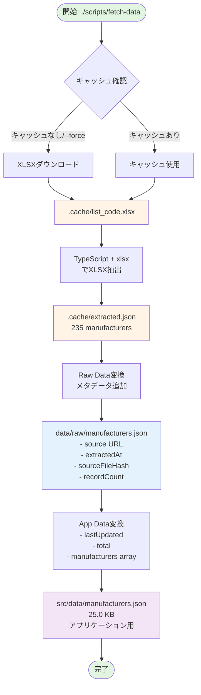
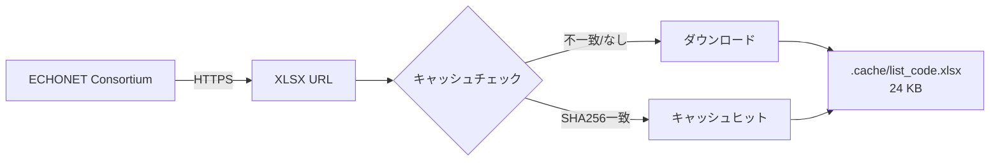
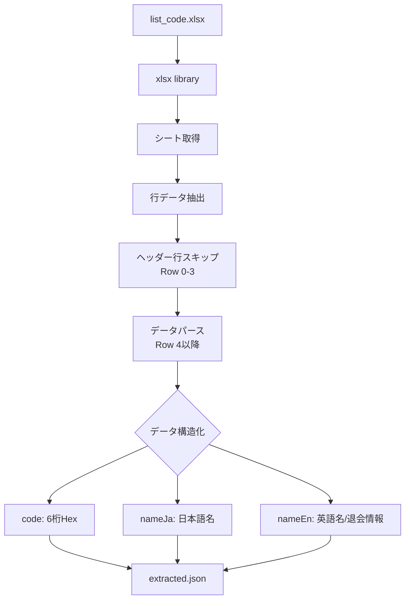
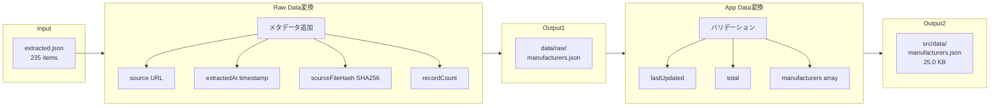
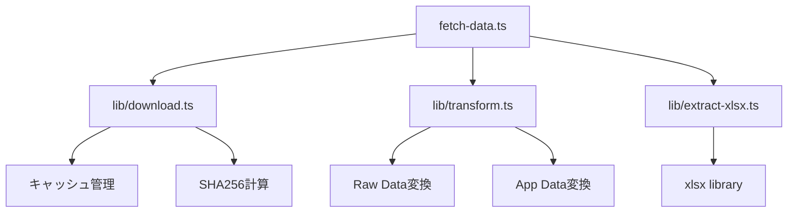
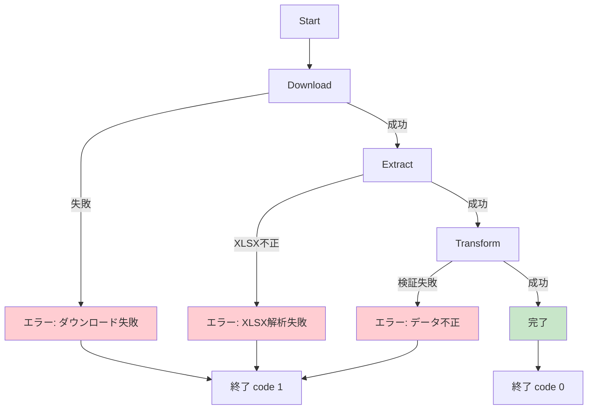

# データ収集フローチャート

## 概要図



## 詳細フロー

### 1. ダウンロードフェーズ



**URL**: `https://echonet.jp/wp/wp-content/uploads/pdf/General/Echonet/ManufacturerCode/list_code.xlsx`

### 2. 抽出フェーズ



**カラム構造**: `[コード, 会社名, 備考]`

### 3. 変換フェーズ



## データ構造

### extracted.json
```json
[
  {
    "code": "000005",
    "nameJa": "シャープ株式会社",
    "nameEn": null
  }
]
```

### data/raw/manufacturers.json
```json
{
  "metadata": {
    "source": "https://...",
    "extractedAt": "2026-01-11T02:46:30.571Z",
    "sourceFileHash": "2b4a55f298...",
    "recordCount": 235
  },
  "manufacturers": [...]
}
```

### src/data/manufacturers.json
```json
{
  "lastUpdated": "2026-01-11",
  "source": "https://...",
  "total": 235,
  "manufacturers": [...]
}
```

## 実行コマンド

### 基本実行
```bash
./scripts/fetch-data
```

### オプション付き実行
```bash
# 強制再ダウンロード
./scripts/fetch-data --force

# 詳細ログ
./scripts/fetch-data --verbose

# ドライラン（ダウンロードスキップ）
./scripts/fetch-data --dry-run
```

## 依存関係



## エラーハンドリング



## パフォーマンス

| フェーズ | 時間 | 備考 |
|---------|------|------|
| ダウンロード | ~0.5秒 | 24 KB |
| XLSX抽出 | ~0.3秒 | xlsx library処理 |
| 変換 | <0.1秒 | JSON処理 |
| **合計** | **~1秒** | 初回実行 |
| キャッシュヒット時 | ~0.4秒 | ダウンロードスキップ |
